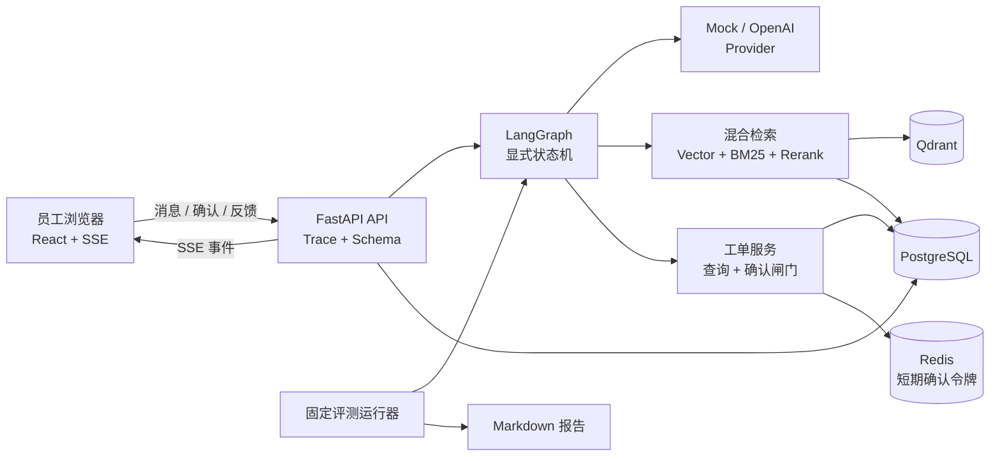

# 系统架构

## 组件图

## 请求数据流

1. API 校验模拟 `user_id` 与会话归属，并生成或传播 `X-Trace-Id`。
2. LangGraph 分类为知识问答、工单查询或工单创建；受限请求在调用外部依赖前转人工。
3. 知识路径混合召回并重排，只有达到证据阈值才调用模型，SSE 返回 `citations` 和 `answered`。
4. 查单路径只调用 `get_ticket_status`，按用户过滤并返回独立终态 `ticket_status`。
5. 建单路径只生成 `TicketDraft` 和绑定用户、会话、草稿哈希、Trace/Run 的 Redis 短期令牌，返回 `awaiting_confirmation`。
6. 独立确认 API 校验令牌、草稿、用户、会话、Trace 和幂等键后写 PostgreSQL；LangGraph 本身没有建单写节点。
7. 节点结果、耗时、Token、引用 ID 与脱敏工具摘要关联到同一 Trace；SSE 依次返回运行、节点、引用/草稿/转人工和最终事件。

## 持久化边界

| 存储 | 数据 | 安全边界 |
| --- | --- | --- |
| PostgreSQL | 用户、会话、消息、Agent Run、知识元数据、工单、事件、审计、bad case | 工单查询始终带用户范围；确认写入事务化、幂等 |
| Qdrant | 知识分块向量与检索载荷 | 保留访问级别过滤接口；不存用户会话 |
| Redis | 短期确认令牌 | 仅存令牌哈希和绑定信息；单次消费、默认 10 分钟过期 |
| Markdown/JSONL | 脱敏知识、种子和固定评测集 | 仓库数据全部为虚构样本 |

## 状态与安全

正式终态为 `answered`、`ticket_status`、`awaiting_confirmation`、`handoff`。状态机最多 8 步；证据不足、模型/检索/工具故障、输入无效和受限请求都进入 `handoff`。写操作只存在于确认路由后的工单服务，必须同时满足有效确认令牌与幂等键。
