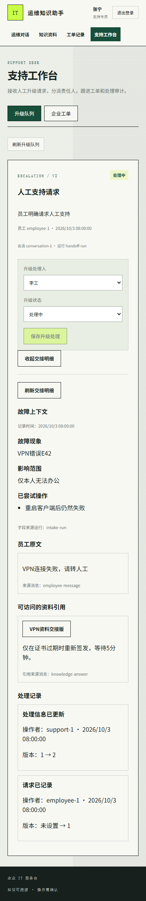
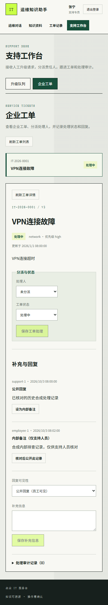
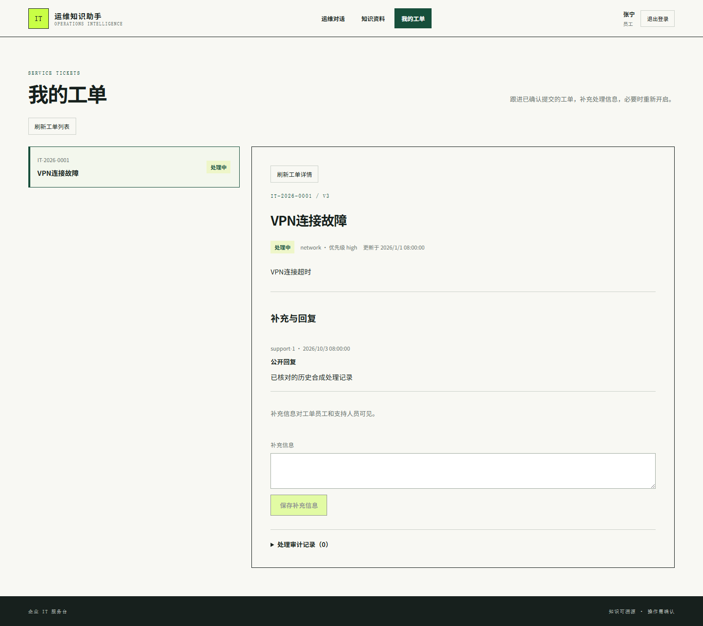

# 公开验收索引

这里保存可以公开的工程验收摘要。业务原文、运行日志、模型完整上下文、身份会话、浏览器 trace、私有样本与完整原始报告留在本地 `artifacts/` 或 CI runner 内，不随项目发布。项目文档中标为“本地证据”的路径表示原报告的留存位置，不是 GitHub 下载链接。

## 当前软件合同

2026-10-03，T03/T04/T05 的作者本机验收及发布前修复回归已完成。最终源码执行结果为 **615 项后端、46 项前端、30 项浏览器测试通过，failures/errors/skipped 均为 0**，执行前收集清单与实际报告逐例一致。后端使用可丢弃 PostgreSQL、Redis、Qdrant；图、HTTP/SSE、worker 与事务场景运行实际实现。浏览器使用 demo 和 Mock HTTP，账号与业务内容为受控测试数据。冻结的 T05 阶段为 537/46/30，发布准备阶段为 569/46/30，均保留各自历史证据，不能替代最终报告。

| 业务路径 | 已实现并本机验证的行为 | 详细合同 |
|---|---|---|
| 知识问答 | 受支持 PDF 布局的页/表/行与单元格出处；Markdown 结构和代码；新旧提取身份、逐篇重解析与引用权限 | [项目审查](../project-audit.md)、[Markdown](../architecture/markdown-structure.md) |
| 查单与进度 | 本人/当前支持权限、对象澄清、重新查询、真实可见记录时间；公开/内部/未分类评论；历史回放和并发降级鉴权 | [查单](../architecture/ticket-lookup.md)、[进度](../architecture/ticket-progress.md) |
| 确认建单 | 员工补齐故障、影响和已尝试操作；当前版本确认；修改重签、并发/回滚/未知结果重试幂等 | [信息收集](../architecture/ticket-intake.md) |
| 人工交接 | 明确动作直接路由；有限员工上下文及当前可见引用；持久编号、待处理状态、支持处理与审计 | [人工上下文](../architecture/handoff-context.md) |

报告 SHA、原审查及作者修复分类见 [软件验收摘要](software-validation.json) 和 [审查修复记录](final-review.md)。旧 `backend/tests/fixtures/vpn-error-codes.pdf` 是仓库原有的未修改测试文件，尚未找到精确重建它的生成脚本；它不能充当真实故障企业 PDF 的验收证据。其他明确合成 PDF 的生成器与限制见源码测试及项目审查。

## CI 与最终交付状态

[生产验证工作流](../../.github/workflows/production-validation.yml) 保留冻结依赖、隔离服务、迁移、构建、真实 Keycloak 协议加 Mock 模型及精确 commit 镜像检查。[报告门禁](../../scripts/ci/check_reports.py) 验证 XML 拓扑、执行前收集清单与 XML/JSON 逐例身份、必需模块及浏览器项目；拒绝失败、错误、跳过、预期失败、重试、遗漏/重复和收集或执行失败。GitHub 报告还要求准确 checkout SHA 与执行后干净源码；上传范围限于安全摘要及对应 commit 镜像 artifact。

整个剩余增量的一次独立审查已完成，原结论为 5 项 Important、ready: No。作者一次修复并完整回归，原 13 项反例保持源码不变后由作者重跑全部通过，没有第二轮 reviewer 或新的独立批准。完整项目已正常推送到 `codex/production-engineering`；软件提交 `6aa3570ecfa6f662d99a5ffccbfc5d6d5346b630` 的 GitHub Actions 四个任务全部成功，实际 616 后端、46 前端、31 Mock 浏览器及 2 项真实协议 E2E 全部通过，0 failures/errors/skipped，三份 commit 镜像构建与包/源码检查通过。测试输入/定位的两项 CI 修复、精确 run、制品及分类见[GitHub 交付记录](github-delivery.md)。本次文档归档另增加小型镜像 metadata 制品，最后提交的实际状态可从记录中的分支 Actions 入口核对。

## 真实门禁

T06 仍需经批准的真实失败 PDF、人工逐页/单元格真值、完整相关集合、真实模型及固定 embedding 环境的答案/引用证据。T07 仍需批准的 Linux/TLS/企业身份、容量、完整空环境恢复、同 schema 回滚及实际告警接收。没有这些输入及执行证据，保持未验；不因源码或镜像可下载而宣称正式生产验收通过。详见 [待办](../improvement-backlog.md) 和 [正式验收](../production-acceptance.md)。

## 已核对的受控界面

以下只展示已人工核对的 Mock HTTP 界面，不表示真实员工、企业身份、模型质量或支持人员实际接单。

